# Summary

This repository presents a real estate appraisal management system designed for professional property appraisers aiming to centralize and efficiently manage their daily workflow. Most existing systems on the market are focused on end-users and are primarily limited to receiving appraisal requests, offering no tools for appraisers themselves to effectively organize, document, or automate their work processes. The developed system aims to address this gap by enabling the digitization and centralization of key appraisal stages: request management, property analysis, data documentation, calculations, and report generation.

During the development process, existing solutions were analyzed, their shortcomings identified, and the system’s core functional requirements were defined. The system architecture is based on the Django framework, with MySQL used for data management, and HTML templates combined with the “WeasyPrint“ library for PDF report generation. The implemented solution emphasizes adaptability, transparency, and compliance with legal regulations and professional valuation standards.

The system includes two main subsystems: user management and property appraisal. It enables data analysis, attachment and annotation of property photos, identification of comparable properties and nearby institutions, scheduling of work tasks, and automated generation of valuation reports. The project is currently a working demonstration prototype, based on which further adaptation and customization can be carried out according to the needs of specific real estate valuation companies.

# Features

- Centralized request management for property appraisals
- Property analysis tools and data documentation
- Automated report generation (PDF via WeasyPrint)
- User management subsystem with role-based access
- Photo attachment and annotation for properties
- Identification of comparable properties and nearby institutions
- Scheduling and workflow management for appraisers
- Compliance with legal and professional standards

# Technology Stack

- **Backend:** Django (Python)
- **Database:** MySQL
- **Frontend:** HTML templates, CSS
- **PDF Generation:** WeasyPrint
- **Localization:** Django i18n, custom scripts

# Installation

See [INSTALL.md](INSTALL.md) for detailed setup instructions.

Basic steps:
1. Create and activate a Python virtual environment
2. Install backend requirements from `requirements.txt`
3. Apply database migrations and create a superuser
4. Start the project using `run.sh`
5. Build localization files with `localize.sh` if needed

# Usage

- Access the system via [http://127.0.0.1:8000/](http://127.0.0.1:8000/)
- Log in as an appraiser, administrator, agency admin or a regular user
- Manage appraisal requests, analyze properties, upload and annotate photos
- Generate and review valuation reports

# Research & Analysis

This project is based on a 127-page bachelor’s thesis, which includes:
- Extensive market analysis of real estate appraisal software
- Comparison of competitor solutions and identification of gaps
- Detailed requirements engineering and system design
- Legal and regulatory compliance review
- Usability studies and workflow optimization for professional appraisers
- Technical evaluation of frameworks and libraries
- System testing, validation, and documentation to ensure reliability and maintainability
- Final conclusions

# Project Structure

See the repository structure for main components:
- `dev/` – Contains the core Django project and all backend logic. Key subfolders:
  - `core/` – Main application logic, models, and views
  - `main/` – Entry point and configuration for the Django project
  - `modules/` – Main system features, organized into modular Django apps:
    - `agency/` – Agency management, evaluator assignment, and report review workflows
    - `orders/` – Appraisal order lifecycle, including creation, editing, notifications, and report generation
    - `evaluator/` – Evaluator-specific tools and dashboards
    - Additional modules can be added for extensibility and customization
    - Each module contains its own models, views, admin configuration, templates, and URLs
  - `shared/` – Shared utilities, resources, and templates used across modules
  - `locale/` – Localization files for multi-language support
  - `manage.py` – Django management script
- `run.sh`, `localize.sh` – Utility scripts for startup and localization

The `modules` folder is the heart of the application, encapsulating all major business logic and workflows. Each module is designed to be self-contained, making it easy to extend or customize the system for specific company requirements. For a full overview of the backend structure and module responsibilities, see the documentation and code comments within each subfolder.

# Customization

The system is designed as a prototype and can be adapted for specific company needs. Modules can be extended, and new features added according to business requirements.

# License

This project is provided for educational and demonstration purposes.

# Contact

For more information, refer to the full thesis or contact the author.

# Visuals

Below are some example screenshots from the system.

<table>
  <tr>
    <td align="center"><b>Evaluator Order Page</b> 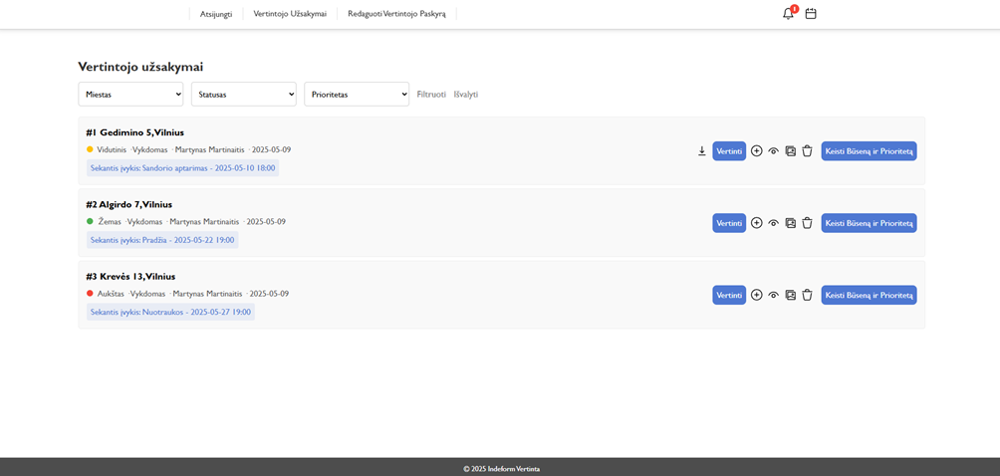</td>
    <td align="center"><b>Evaluation Steps Page</b> 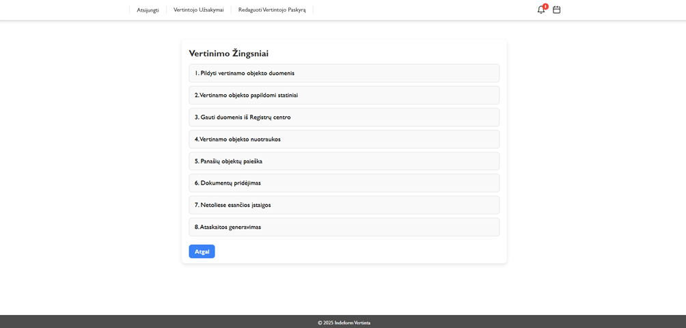</td>
  </tr>
  <tr>
    <td align="center"><b>Evaluation Object Data Edit Page</b> 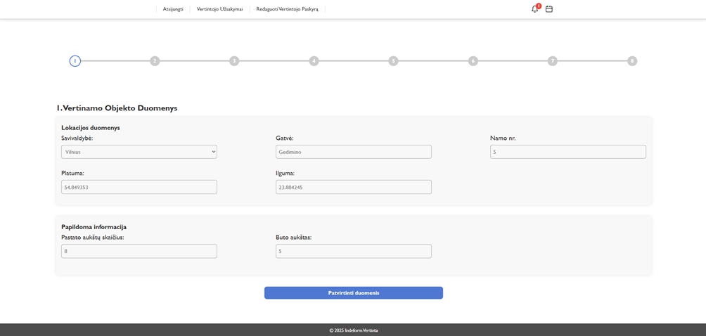</td>
    <td align="center"><b>Additional Buildings Page</b> 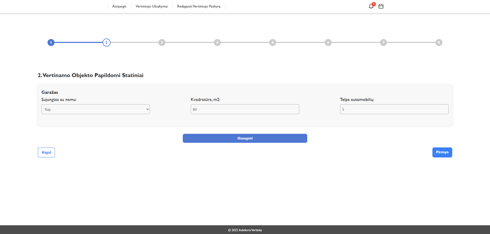</td>
  </tr>
  <tr>
    <td align="center"><b>RC Data Page</b> 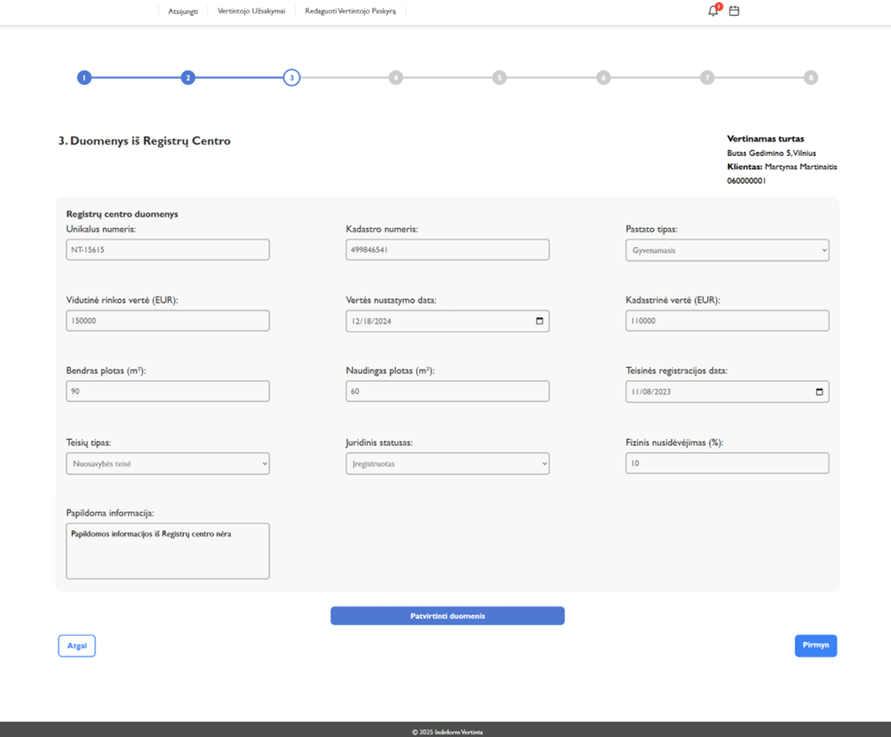</td>
    <td align="center"><b>Object Gallery Page</b> 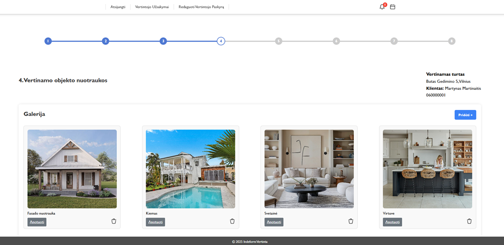</td>
  </tr>
  <tr>
    <td align="center"><b>Annotation Page</b> 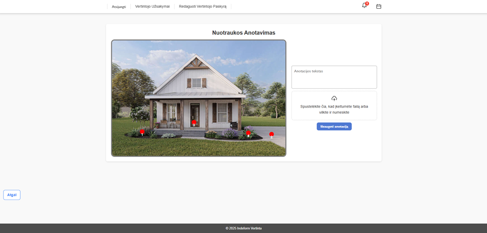</td>
    <td align="center"><b>Similar Object Page</b> 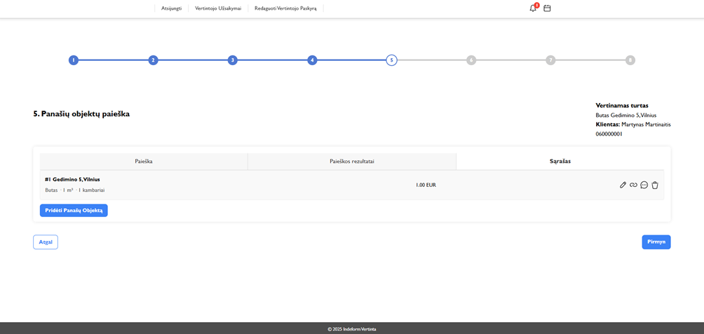</td>
  </tr>
  <tr>
    <td align="center"><b>Document Addition Page</b> 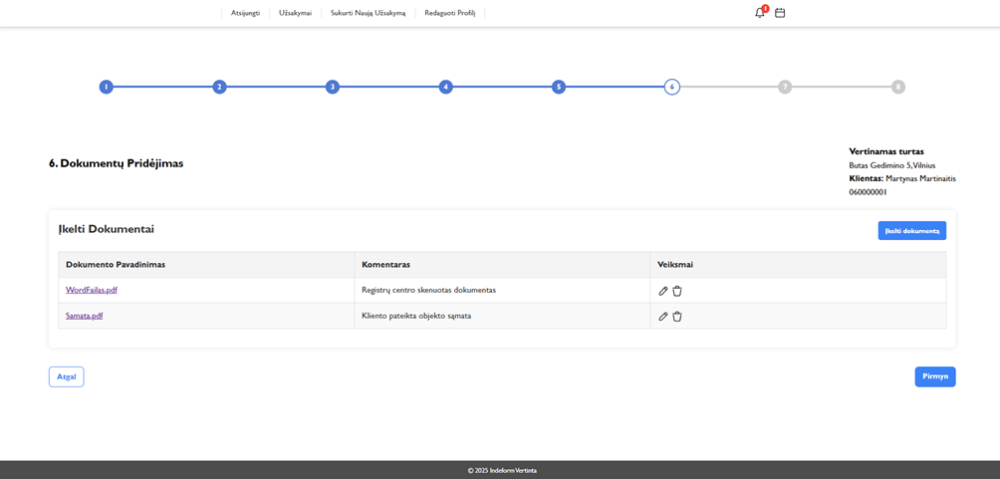</td>
    <td align="center"><b>Nearby Organization Page</b> 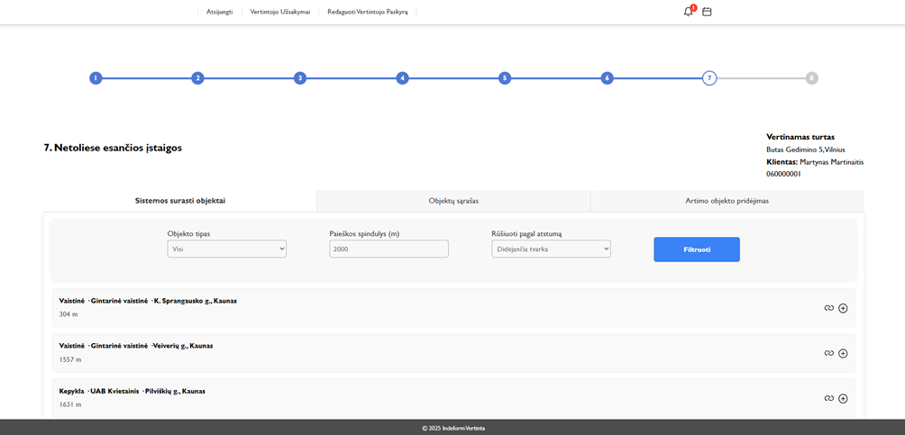</td>
  </tr>
  <tr>
    <td align="center"><b>Evaluation Generation Page</b> 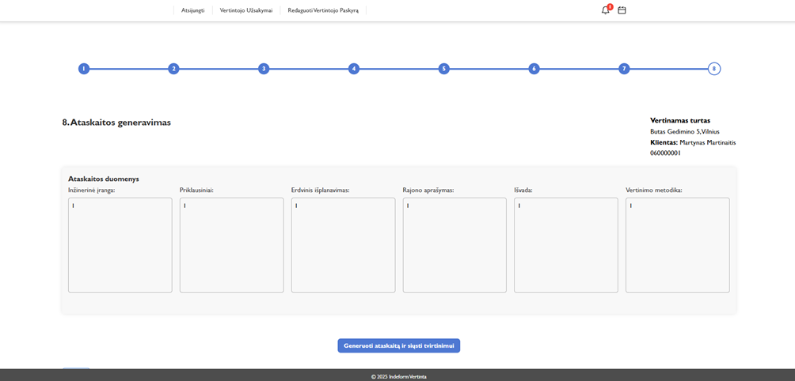</td>
    <td align="center"><b>Title Page of Generated Report</b> 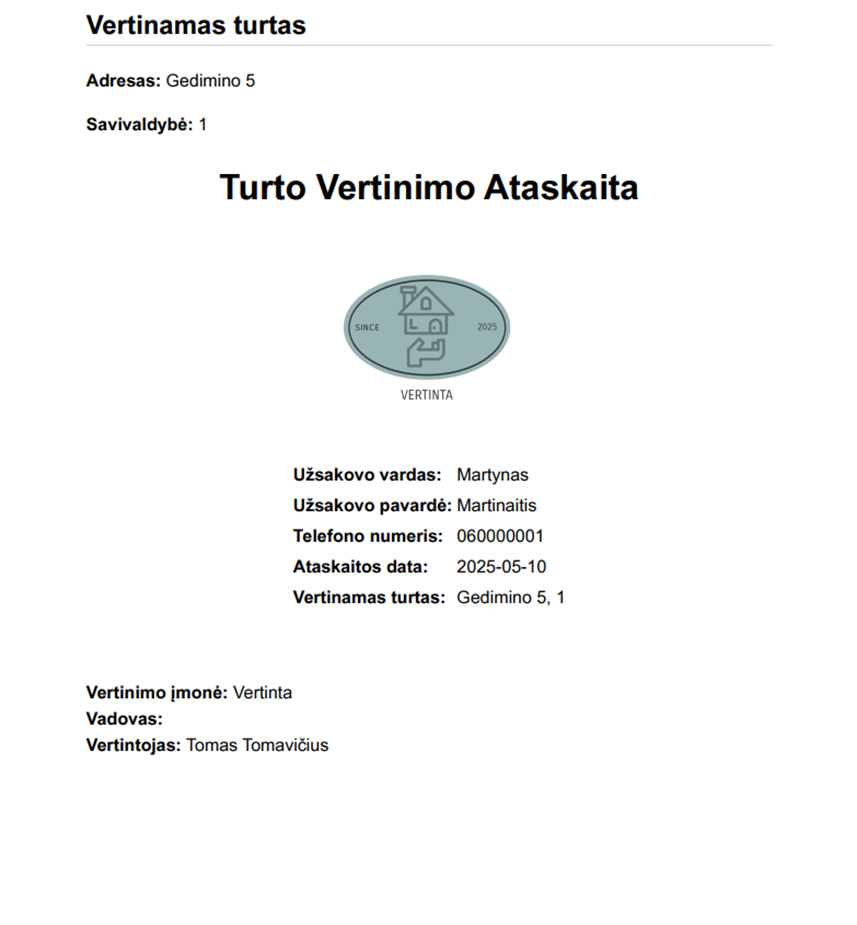</td>
  </tr>
  <tr>
    <td align="center"><b>Calendar Page</b> 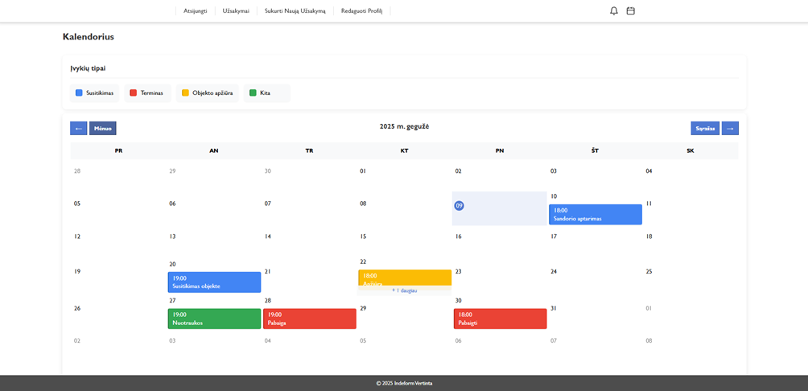</td>
  </tr>
</table>

Many more pages are available for different user roles and functions.